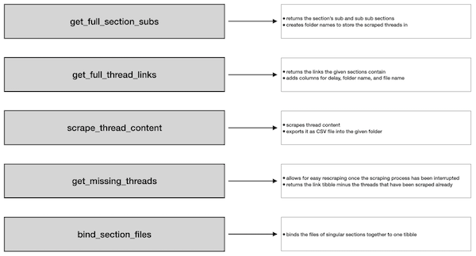

```{r, include = FALSE}
knitr::opts_chunk$set(
  collapse = TRUE,
  comment = "#>"
)
```

```{r setup, include = FALSE}
knitr::opts_chunk$set(include = TRUE)
library(flashbackscrapR)
```

# Introduction

Sometimes you may find yourself in the situation that you want to scrape full sections and all of their threads. This is what the functions that start with the prefix `get_full_` are made for: they allow you to get the section and thread suffixes for entire sections. Both functions are complementary: `get_full_section_subs`returns a tibble that can -- with slight modifications -- be passed on to `get_full_thread_links`. You may also want to store the scraping results in a folder structure that is akin to the structure the sub- and sub-sub-sections have on flashback. The `get_full_` functions enable you to do this by automatically creating a folder name according to the section names which can then be passed on to `scrape_thread_content`. Moreover, the scraping process usually take multiple days (depending on the number of threads you go for) and not getting every one of the threads at first is often inevitable. This requires functions that facilitate the re-scraping of the remaining threads. `get_missing_threads` got you covered here, at least as long as you have stored your links to scrape and exported the files throughout the scraping process. Eventually, you will want to cram the individual sections together into one tibble. 
Once the scraping process is finished, you will want to combine the content of the respective sections into one .csv file per section. `bind_section_files` will do the job for you.

The following figure illustrates the aforementioned steps:



The following section will guide you through the process of scraping full sections. Code examples will be provided, but due to the fact that they would have to run each time this vignette is knit, I will not execute the code but rather opt for loading example data to exemplify the output.

# The work flow

First, you will want to choose your section of interest. In my case, it is the science section. Then, you go to [www.flashback.org](www.flashback.org) and copy the suffix.


`get_full_section_subs()` provides you with its sub sections' suffixes. Besides, you can specify the name of the folder you want to store the results in. Normally, you would want to choose a name that stands for the section -- in my case "science". 

```{r eval=FALSE, include=TRUE}
get_full_section_subs(main_section_suffix = "/f102", folder_name = "science")
```

The result then looks like this:

```{r echo=FALSE, message=FALSE, warning=FALSE}
(readr::read_csv("auxiliary_files/science_subs.csv"))
```

`suffix` refers to the sub section's suffix, `path` is a folder name created from the section names on flashback. 

`get_full_thread_links` is optimized to work with this output tibble. This implies that, in theory, you are not required to specify further arguments to work with it. In most of the cases, however, you will want to not scrape links to threads with no activity after a certain cut-off date. Also, you will be in a situation where you will just prefer to scrape without delays between each request (even though flashback does not want you to). Hence, I will make some slight modifications to the tibble (using `dplyr`). By default, the links and a table containing meta data on the scrape (i.e., time, suffix, chosen cut-off) are exported as CSV files. The folder it shall be stored in can be specified with the argument `output_folder`.

```{r message=FALSE}
sub_sections <- readr::read_csv("auxiliary_files/science_subs.csv") %>% 
  dplyr::mutate(cut_off = "2020-11-09",
                delay = FALSE)
```

```{r echo=FALSE}
sub_sections
```

Then, I can pass those arguments on to the `get_full_thread_links` function. I thereby use `purrr::pmap` as it takes the entire tibble and then iterates through it row by row passing the each value to the corresponding argument.

```{r eval=FALSE, include=TRUE}
thread_links <- sub_sections %>% 
  purrr::pmap(get_full_thread_links) %>% 
  dplyr::bind_rows()
```

The results look like this:

```{r echo=FALSE, message=FALSE, warning=FALSE}
(thread_links <- readr::read_csv("auxiliary_files/thread_links.csv"))
```

As `scrape_thread_content` does not take the sub_suffix argument, the column needs to be dropped. Again, if you want to override the default break the scraper takes after each iteration, a `delay` column needs to be added. 

```{r message=FALSE, warning=FALSE}
thread_links_for_scrape <- thread_links %>% 
  dplyr::select(-sub_suffix) %>% 
  dplyr::mutate(delay = FALSE)
```
```{r echo=FALSE}
thread_links_for_scrape
```

Then, again, the resulting tibble can be passed on to the next function using `purrr`. In the following example, I will just scrape the first 10 threads. Given that I have provided it a vector of folder and file names, the function will also create a folder and export the file at the specific path. Due to this feature, I can forgo storing it in a list in my environment and use `purrr::pwalk` instead of `purrr::pmap`. Furthermore, it is highly advisable to store the exact version of the link tibble that you use for the scrape somewhere on your machine as you will need it in case the scraper does not catch all the threads you wanted (this can happen due to multiple problems, such as connection timeouts or simply the server temporarily blocking your scraper). Then you can use the tibble with the links to compare it with the threads you have caught by using the `get_missing_threads` function.

```{r eval=FALSE, include=TRUE}
thread_links_for_scrape %>% 
  dplyr::slice(1:10) %>% 
  purrr::pwalk(scrape_thread_content)

thread_links_for_scrape %>% 
  dplyr::slice(1:11) %>% #for illustration purposes, see later
  readr::write_csv("science/link_tbl.csv")
```

The structure of the newly created folders is based on the folder names specified in the column `folder_name`. In my case, it looks like the following:

```{r}
fs::dir_tree("science")
```

Here, each folder only contains a few threads since I, on the one hand, have limited the number of threads to the ones with new postings from 2020-11-09 (this vignette is written on 2020-11-10), and, on the other hand, just have scraped the first 10 threads from the resulting tibble. However, if you aim for scraping entire sections, you will likely choose cut-offs that are further back in time and, therefore, end up with thousands of individual thread files. 

The next step is checking for missing files and rescraping them. For illustratory purposes, I have added one link to the stored tibble that hasn't been scraped so far. 

```{r message=FALSE, warning=FALSE, include=TRUE}
missing_links <- readr::read_csv("science/link_tbl.csv") %>% 
  get_missing_threads(link_tbl = ., folder_name = "science")
```

```{r echo=FALSE}
missing_links
```

This can now be passed on to the `scrape_thread_content` function:

```{r eval=FALSE, include=TRUE}
missing_links %>% purrr::pwalk(scrape_thread_content)
```

Ideally, this second try solves every problem. If it does not, try again, and if that has not solved everything, file an issue on GitHub and I will look into it. 

Now that everything has gone well, the files in the respective folder should be bound together. This is to keep the folders sort of clean. The function takes the name of the section folder -- in my case, this is "science" -- and returns a list of tibbles. Those can be exported into the section folder by setting `export_csv = TRUE`. This stores the resulting tibbles in a folder named `files`.

```{r eval=FALSE, include=TRUE}
bind_section_files("science")
```

```{r include=FALSE}
list <- bind_section_files("science")
```

```{r echo=FALSE}
str(list)
```

