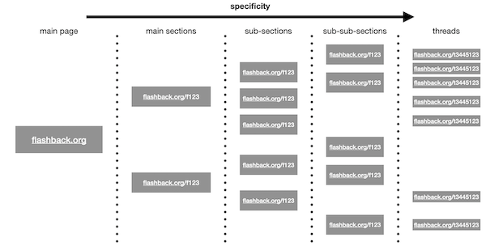

```{r, include = FALSE}
knitr::opts_chunk$set(
  collapse = TRUE,
  comment = "#>"
)
```

```{r setup}
knitr::opts_chunk$set(include = FALSE)
library(flashbackscrapR)
```

# Introduction

This vignette's goal is to enable you to use `flashbackscrapR` in a meaningful way. In order to achieve this, its functionality and the rationale behind it are to be described. First, a brief overview of the structure of <www.flashback.org> is given. Second, the functions of `flashbackscrapR` are described. Third, examples are provided which show how to use it. 

## The structure of www.flashback.org

Figure 1 depicts the simplified structure of www.flashback.org. 



* **main sections** are the first structural unit. They are fairly unspecific. "Droger," for instance, contains all kinds of drug-related content.  
* **sub-sections** are contained within main sections. They are a bit more specific than the main sections. They sometimes contain
**sub-sub-sections** which are even more specific.  
* **threads** are contained within either **sub-sections** or **sub-sub-sections**. They are as specific as they can get and contain the users' postings. They usually are what you want to mine.  
* The link structure looks like this: www.flashback.org is the main URL. It leads to the main page. To go to a certain section or thread, a suffix needs to be added. The suffix and the main URL have to be separated by */*. Suffixes that lead to a section start with an *f* and end with a number (e.g., www.flashback.org/f4). Suffixes that relate to singular threads start with a *t* (e.g., www.flashback.org/t2343244). If a section or thread contains multiple pages, the page number is added to the link, separated by a *p* (e.g., the second page of the aforementioned thread: www.flashback.org/t2343244p2). The suffixes that are imputed into the scraping function always have to start with the slash "/".

## `flashbackscrapR`'s functionality

### The logic behind it

Scraping flashback.org usually looks like this: You first choose the section you want to scrape. For instance, if you want drug-related postings, you should choose the main section *Droger*. Then, you look at the section's sub-sections. The question that you should ask yourself now is whether you can make your goal of interest more specific. If so, you can select certain sub-sections that contain the content you aim to mine. Sometimes, sub-sections also contain sub-sub-sections which are even more specific. Again, ask yourself whether you want them all or whether it is likely that all you want to mine is hidden within one sub-sub-section. The penultimate step is to get the thread links -- they are the entity that actually contains the content you are after. Finally, you can pass them to the actual scraping function and let the machine do its work. 

### The specific functions

The function `get_main_sections()` provides you with a tibble containing the main sections' names and suffixes. Here, you do not have to specify anything, just call the function.  

One of the suffixes can then be put into `get_sub()` -- this returns the sub-sections of the main section. If no valid suffix is provided, an error will be reported. `get_sub()` returns a tibble with the sub-sections name and suffix.    

If there are sub-sub-sections, using `get_subsub()` provides you with them. Always check for them. If you do not, you might miss some important content. `get_subsub` returns a tibble with the sub-sub-sections' names and suffixes. If there are none, it returns a warning (and a tibble with both columns `NULL`). Then go on with the sub-sections suffix.     

Since you want to scrape singular threads, you need to acquire their links first. Choose your sub-section(s) and/or sub-sub-section(s) and throw them into `get_thread_links()`. It will return a vector containing the singular threads' suffixes. If there is only a specific period of time you want to collect data from, you can specify it using the `cut_off = "YYYY-MM-DD"` argument. The function will then only return the links to threads whose latest entry was posted **on** or **after** the cut-off date you provided. If you want to scrape an entire sub-section, you need to scrape the sub-section and its sub-sub-sections.    

Finally, `scrape_thread_content()` can then be used to mine the threads' content. In practice, you will want the function to iterate over a vector of thread links (learn more about this in the example section). As all scraping functions are prone to crashing due to manifold reasons, `scrape_thread_content()` has a built-in safety net: it can automatically export your results into a CSV file. For doing so, you have to set `export_csv = TRUE` or specify a `folder_name = ""` or `file_name = ""`. Then, if only `export_csv = TRUE`, it exports a file named "scrape-YYYY-MM-DD.csv" (YYYY-MM-DD stands for the date you scraped it) into your working directory. You can either change the working directory manually using `setwd()`, or create a folder in it which is dedicated to the scrape. You can specify the folder's name in the `folder_name = ""` argument. Please note that the folder has to exist beforehand. The output file's name can be changed by specifying a name in `file_name = ""`. If you iterate over multiple threads with simply specifying a file name, your output files will be overwritten every iteration. So please be aware of that your file name needs to change every iteration (e.g., by using `paste0()` and a current number or so) in order to avoid that. Another way of dealing with failure is by using `purrr::safely()`.

## Exemplary scrape

In the following, I will guide you through the scraping process of flashback.org's "Droger" section. For iterating over vectors, I will use `purrr::map()`. Please familiarize yourself with it beforehand, for instance by reading [this](https://purrr.tidyverse.org/reference/map.html). For basic data wrangling, I will mainly use functions from `tidyverse` packages in general. Please familiarize yourself with it beforehand, for instance by reading [this](https://r4ds.had.co.nz/index.html). This could also be entirely accomplished using base R, loops, and the apply() family, but I refuse to write a tutorial on this.

```{r}
library(flashbackscrapR)
```


`get_main_sections()` returns a tibble with the main sections' names and suffixes. Wrapping an assigning function in `()` prints its output to the console.

```{r}
(main_sections <- get_main_sections())
```

As I am especially interested in "Droger", I filter the suffix that relates to it and put it into a vector:

```{r}
(drug_main_suffix <- main_sections %>% 
  dplyr::filter(name == "Droger") %>% 
  purrr::pluck(2))
```

Now I can acquire its sub-sections using `get_sub()`:

```{r}
(drug_sub_sections <- get_sub(drug_main_suffix))
```

Well, I am a laid-back dude and, hence, have a natural interest in Cannabis. Therefore, I will only choose content that is related to Cannabis:

```{r}
(cannabis_suffix <- drug_sub_sections %>% 
   dplyr::filter(name == "Cannabis") %>% 
   purrr::pluck(2))
```

Now I will check whether there are any sub-sub-sections:

```{r}
(cannabis_sub_sub_sections <- get_subsub(cannabis_suffix))
```

And, indeed, there are three in total. However, I have a vital interest in Cannabis and want to scrape everything Cannabis-related flashback.org has to offer. First, I build a vector with the suffixes of the Cannabis sub-sections and its sub-sub-sections. Second, since I want to only get the postings from the last two days, I create a tibble with two columns: the suffixes and the cut-off date. Third, I iterate over the tibble, applying the `get_thread_links()` function to every line. 

```{r}
(cannabis_suffixes <- c(cannabis_suffix, purrr::pluck(cannabis_sub_sub_sections, 2)))
(cannabis_suffixes_tbl <- tibble::tibble(
  suffix = cannabis_suffixes,
  cut_off = "2020-05-26"
))
(thread_links <- purrr::pmap(cannabis_suffixes_tbl, get_thread_links))
```

This returns a list. My goal is to get a tibble I can iterate over in the same manner, applying `scrape_thread_content()` to every row. This tibble has to contain several columns: One column containing the thread link. One column specifying the folder I want to store the resulting CSV file in. One column with a name that is different for every file (I achieve this by using a current number and `paste0()`). Since I provide a folder and file name, I do not have to explicitly tell the function that I want it to export the results. 

```{r}
(thread_links_tbl <- tibble::tibble(
  suffix = thread_links %>% purrr::reduce(c),
  folder_name = "test_scrape",
  file_name = paste0(rep("scrape", length(thread_links %>% purrr::reduce(c))), 
                     seq_along(thread_links %>% purrr::reduce(c)))
))


```

Now I have created a tibble to map over. Since I am worried that my scraping process could crash, I wrap `scrape_thread_content()` with `purrr::safely()`. This implies that in the case that `scrape_thread_content()` fails in scraping a thread, it does not break the entire process, but only prints an error in the list. Scraping can take very long, especially as flashback.org asks me to take breaks between requests. For the sake of this tutorial, I created a tibble with two threads that are both rather small (<10 postings).

```{r message=FALSE, warning=FALSE, include=FALSE}
test_thread_links_tbl <- tibble::tibble(
  suffix = c("/t1434757", "/t1906842"),
  folder_name = "test_scrape",
  file_name = paste0(rep("scrape", 2),
                     1:2)
)
```

```{r}
scrape_results <- purrr::pmap(test_thread_links_tbl, purrr::safely(scrape_thread_content))

str(scrape_results)
```

The scraping process was successful. Finally, I can now extract the tibbles from the list and bin them together to one tibble:

```{r}
(results_tbl <- scrape_results %>% 
  purrr::transpose() %>% 
  purrr::pluck(1) %>% 
  dplyr::bind_rows())
```

Furthermore, both threads have been saved into the folder I specified earlier. If I wanted to read them in from there, I would use the `vroom` and `fs` packages. This procedure works with whatever number of files are stored in the folder:

```{r message=FALSE}
(files <- fs::dir_ls("test_scrape/", glob = "*.csv"))
(data <- purrr::map(files, vroom::vroom) %>% 
  purrr::transpose() %>% 
  purrr::map(unlist) %>% 
  dplyr::bind_cols() %>% 
  dplyr::mutate(date = lubridate::as_date(date),
                hour = lubridate::hour(lubridate::as_datetime(time)),
                minute = lubridate::minute(lubridate::as_datetime(time))) %>% 
  dplyr::select(url, date, hour, minute, author_name, posting, posting_wo_quote, quoted_user))
```

